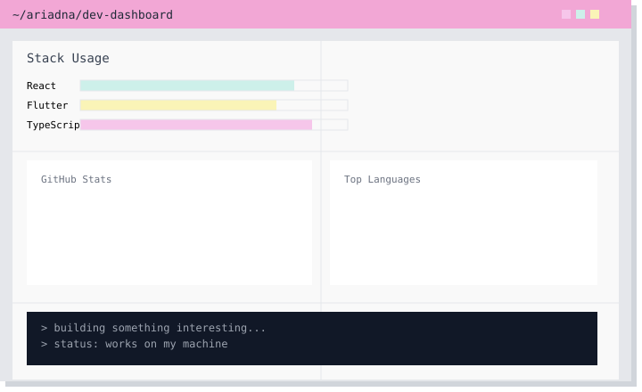

---

---

## 🚀 Tech Stack

## 🧩 Frontend Architecture

---
## 🖥️ Things I’ve built

---
## 🧰 Tools I work with

---

## 🔗 Connect

  

- 💼 [LinkedIn](https://www.linkedin.com/in/ariadna-villagra/)
- 📄 [CV (PDF, more details if you’re into that)](./assets/Curr%C3%ADculum%20Ariadna%20Villagra%20%28EN%29.pdf)

